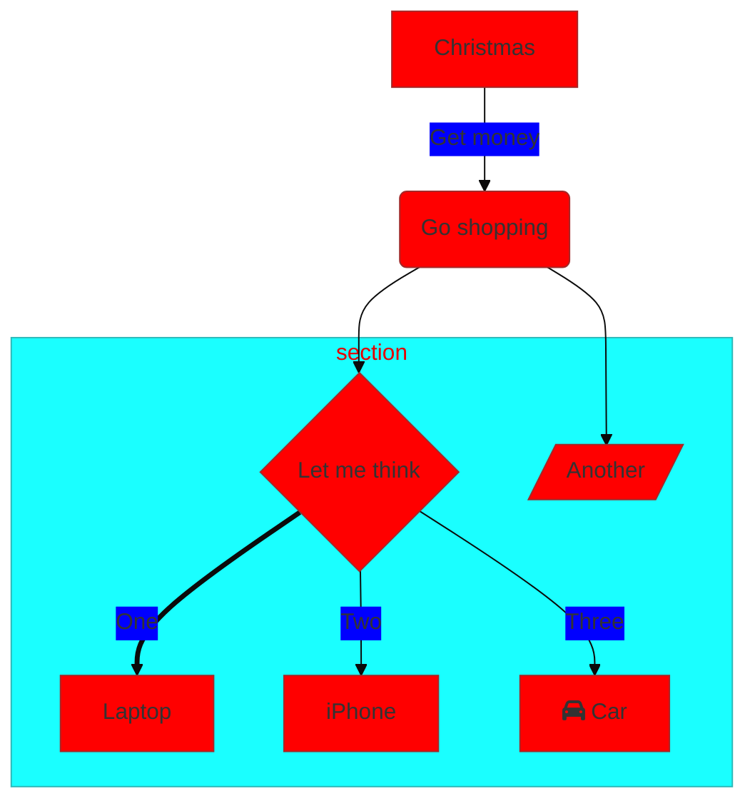

# This doc is for testing styling problems

Here is a markdownn table:

| Hello       | there     | Tilte  |   |   |
|-------------|-----------|--------|---|---|
| Value one   | Value two | `code` |   |   |
| Empty cells |           |        |   |   |
|             |           |        |   |   |

Code block

```js
const person = 'one';

const func = () => {
  return 'this is a func';
};
```

Headings

## Heading one

[Attribute Lists](#){ data-preview }

## Heading 2

### heading three

Version number: 2

### heading 4

Embedded images


## Graphviz

This should render a small diagram as long as `graphviz` is available in the environment
where the docs are generated. [MkDocs will use it automatically](https://github.com/backstage/mkdocs-techdocs-core/blob/main/src/core.py#L106).



## PlantUML

```plantuml format="png" classes="uml myDiagram" alt="My super diagram placeholder" title="My super diagram" width="300px" height="300px"
  Goofy ->  MickeyMouse: calls
  Goofy <-- MickeyMouse: responds
```

::uml:: format="png" classes="uml myDiagram" alt="My super diagram placeholder" title="My super diagram" width="300px" height="300px"
  Goofy ->  MickeyMouse: calls
  Goofy <-- MickeyMouse: responds
::end-uml::


## Mermaid 
This project contains a few lambdas to handle managing installations, github webhook handlers and dishing out tokens to backstage backends.



## Images

## LOCAL PNG


## LOCAL SVG


## CROSS DIR PNG


## heading 5

Version number: 2

## heading 6

Version number: 2

## heading7

Version number: 2

## heading8

Version number: 2

### heading8

Version number: 2

### heading9

Version number: 2

### heading10

Version number: 2

### heading11

Version number: 2

### heading12

Version number: 2

### heading13

Version number: 2
### heading14

Version number: 2

### heading15

Version number: 2

### heading16

Version number: 2

### heading17

Version number: 2

### heading18

Version number: 2

### heading19

Version number: 2

### heading20

Version number: 2

## heading9

Version number: 2

## heading10

Version number: 2

## heading11

Version number: 2

## heading12

Version number: 2

## heading13

Version number: 2
## heading14

Version number: 2

## heading15

Version number: 2

## heading16

Version number: 2

## heading17

Version number: 2

## heading18

Version number: 2

## heading19

### heading 5

Version number: 2

### heading 6

Version number: 2

### heading7

Version number: 2

### heading8

Version number: 2

#### heading8

Version number: 2

#### heading9

Version number: 2

Version number: 2

## heading20

Version number: 2

