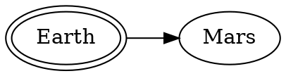

# This doc is for testing styling problems

Here is a markdown table:

| Hello       | there     | Tilte  |   |   |
|-------------|-----------|--------|---|---|
| Value one   | Value two | `code` |   |   |
| Empty cells |           |        |   |   |
|             |           |        |   |   |

Code block

```js
const person = 'one';

const func = () => {
  return 'this is a func';
};
```

Headings

# Heading one

## Heading 2

### heading three

Version number: 2

### heading 4

Embedded images


# Graphviz

This should render a small diagram as long as `graphviz` is available in the environment
where the docs are generated. [MkDocs will use it automatically](https://github.com/backstage/mkdocs-techdocs-core/blob/main/src/core.py#L106).



# PlantUML

```plantuml format="png" classes="uml myDiagram" alt="My super diagram placeholder" title="My super diagram" width="300px" height="300px"
  Goofy ->  MickeyMouse: calls
  Goofy <-- MickeyMouse: responds
```

::uml:: format="png" classes="uml myDiagram" alt="My super diagram placeholder" title="My super diagram" width="300px" height="300px"
  Goofy ->  MickeyMouse: calls
  Goofy <-- MickeyMouse: responds
::end-uml::


# Mermaid 
This project contains a few lambdas to handle managing installations, github webhook handlers and dishing out tokens to backstage backends.


