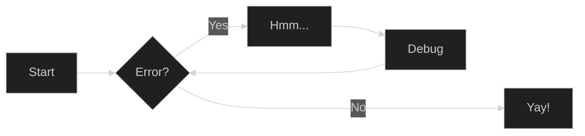

```mermaid
%%{init: {'theme': 'dark', 'themeVariables': { 'darkMode': 'true' }}}%%
graph LR
  A[Start] --> B{Error?};
  B -->|Yes| C[Hmm...];
  C --> D[Debug];
  D --> B;
  B ---->|No| E[Yay!];
```
