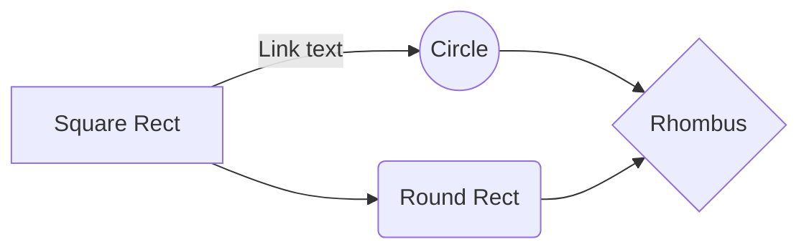

[comment]: <> (```mermaid)

[comment]: <> (%%{init: {'theme': 'forest'}}%%)

[comment]: <> (graph LR)

[comment]: <> (  A[Start] --> B{Error?};)

[comment]: <> (  B -->|Yes| C[Hmm...];)

[comment]: <> (  C --> D[Debug];)

[comment]: <> (  D --> B;)

[comment]: <> (  B ---->|No| E[Yay!];)

[comment]: <> (```)


