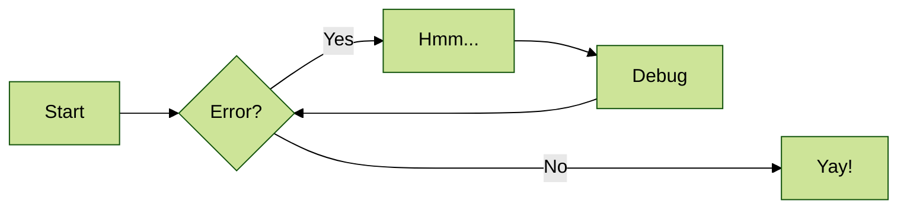

```mermaid
%%{init: {'theme': 'forest'}}%%
graph LR
  A[Start] --> B{Error?};
  B -->|Yes| C[Hmm...];
  C --> D[Debug];
  D --> B;
  B ---->|No| E[Y<a xlink:href="http://google.com" target="__blank">ay</a>!];
```
