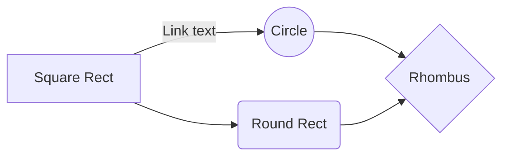
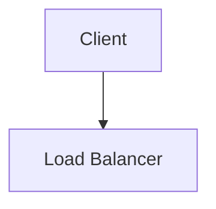
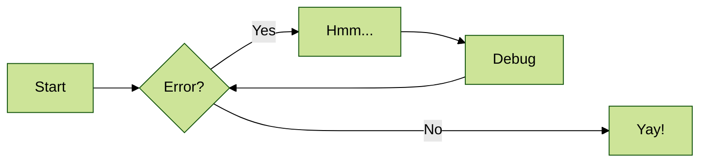

```mermaid
graph LR
    A[Square Rect] -- Link text --> B((Circle))
    A --> C(Round Rect)
    B --> D{Rhombus}
    C --> D
```

```mermaid
graph TD
A[Client] --> B[Load Balancer]
```

Graphvis:


```mermaid
%%{init: {'theme': 'forest'}}%%
graph LR
  A[Start] --> B{Error?};
  B -->|Yes| C[Hmm...];
  C --> D[Debug];
  D --> B;
  B ---->|No| E[Yay!];
```

