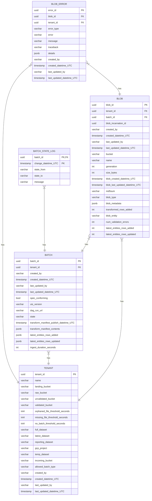

## Something something 

##### Mermaid

```mermaid
erDiagram
    BLOB {
        uuid blob_id PK
        uuid tenant_id FK
        uuid batch_id FK
        uuid blob_incarnation_id
        varchar created_by
        timestamp created_datetime_UTC
        varchar last_updated_by
        timestamp last_updated_datetime_UTC
        varchar bucket
        varchar name
        int generation
        int size_bytes
        timestamp blob_created_datetime_UTC
        timestamp blob_last_updated_datetime_UTC
        varchar md5sum
        varchar blob_type
        jsonb blob_metadata
        int transformed_rows_added
        varchar blob_entity
        int num_validation_errors
        int latest_entities_rows_added
        int latest_entities_rows_updated
    }
    BATCH {
        uuid batch_id PK
        uuid tenant_id FK
        varchar created_by
        timestamp created_datetime_UTC
        varchar last_updated_by
        timestamp last_updated_datetime_UTC
        bool spec_conforming
        varchar uis_version
        varchar dag_run_url
        varchar state
        timestamp transform_manifest_publish_datetime_UTC
        jsonb transform_manifest_contents
        jsonb latest_entities_rows_added
        jsonb latest_entities_rows_updated
        int ingest_duration_seconds
    }
    BLOB_ERROR {
        uuid error_id PK
        uuid blob_id FK
        uuid tenant_id FK
        varchar error_type
        varchar error
        varchar message
        varchar traceback
        jsonb details
        varchar created_by
        timestamp created_datetime_UTC
        varchar last_updated_by
        timestamp last_updated_datetime_UTC
    }
    BATCH_STATE_LOG {
        uuid batch_id PK, FK
        timestamp change_datetime_UTC PK
        varchar state_from
        varchar state_to
        varchar message
    }
    TENANT {
        uuid tenant_id PK
        varchar name
        varchar landing_bucket
        varchar raw_bucket
        varchar unvalidated_bucket
        varchar validated_bucket
        int4 orphaned_file_threshold_seconds
        int4 missing_file_threshold_seconds
        int4 no_batch_threshold_seconds
        varchar full_dataset
        varchar latest_dataset
        varchar reporting_dataset
        varchar gcp_project
        varchar temp_dataset
        varchar incoming_bucket
        varchar allowed_batch_type
        varchar created_by
        timestamp created_datetime_UTC
        varchar last_updated_by 
        timestamp last_updated_datetime_UTC
    }
    BATCH_STATE_LOG }|--|| BATCH: has
    BATCH }|--|| TENANT: has
    BLOB_ERROR }|--|| TENANT: has
    BLOB_ERROR }|--|| BLOB: has
    BLOB }|--|| BATCH: has
    BLOB }|--|| TENANT: has
```
